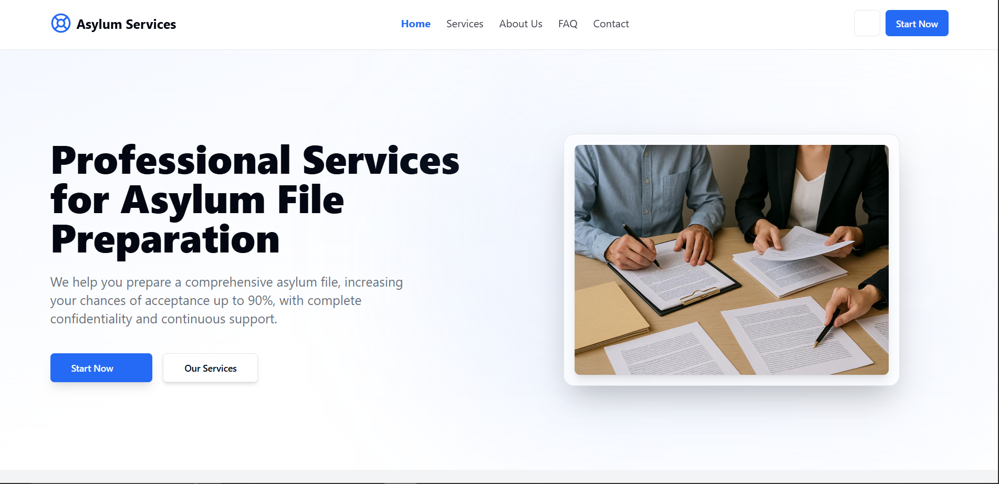

# DevFolio – Mahmoud Farrag's Portfolio

Welcome to my personal portfolio! 🚀  
Showcasing my skills, projects, and experience as a full-stack developer.

## ✨ Features

- **Modern Design:** Responsive layout, smooth animations, and clean UI.
- **Skills Overview:** Visual skill bars for frontend, backend, and other technologies.
- **Project Gallery:** Filterable grid of recent projects with tech stack highlights.
- **Contact Section:** Easy-to-use contact form and social links.
- **Mobile Friendly:** Optimized for all devices.

## 🛠️ Tech Stack

- **Frontend:** HTML5, CSS3, JavaScript (ES6+)
<!-- - **Frameworks:** React, Angular.js, Vue.js
- **Backend:** Node.js, Express
- **Database:** MongoDB
- **Other:** Git, Firebase, Redux, Material UI, GSAP -->

## 📁 Project Structure

```
src/
  index.html
  public/
    unnamed.jpg
    projectAnalytic.png
  scripts/
    main.js
  styles/
    main.css
```

## 🚩 Getting Started

1. **Install dependencies:**
   ```sh
   pnpm install
   ```
2. **Run locally:**
   ```sh
   pnpm run dev
   ```
3. **Build for production:**
   ```sh
   pnpm run build
   ```

## 📷 Preview

<!--  -->

## 📬 Contact

Feel free to reach out via [email](mailto:mahmoud.mo.farrag@gmail.com) or connect on [LinkedIn](https://linkedin.com/in/yourusername).

---

> Built with ❤️ by Mahmoud Farrag
